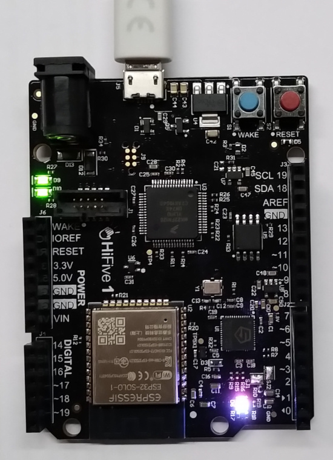

[](https://circleci.com/gh/Rubusch/docker__zephyr__riscv-hifive1)
[](https://www.gnu.org/licenses/old-licenses/gpl-2.0.en.html)


# docker__zephyr__riscv-hifive1



Docker container for Sifive RISC-V HiVive1 Board.  


## References

www.sifive.com/go/hifive1-revb-getting-started  
https://docs.zephyrproject.org/latest/boards/riscv/hifive1/doc/index.html  
https://risc-v-getting-started-guide.readthedocs.io/en/latest/zephyr-hifive1.html  


## Build

```
$ cd ./docker/
$ time docker build --build-arg USER=$USER -t rubuschl/zephyr-hifive1:$(date +%Y%m%d%H%M%S) .
```

(opt) Append ``--no-cache`` for really re-building the container, which may fix some build bugs  


## Usage

In case of Tag **20191104161353**, enter the container or simply build leaving out the ``/bin/bash``  

```
$ docker images
    REPOSITORY                    TAG                 IMAGE ID            CREATED             SIZE
    rubuschl/zephyr-hifive1       20191104161353      cbf4cb380168        24 minutes ago      10.5GB
    ...

$ docker run --rm -ti --privileged --user=$USER:$USER --workdir=/home/$USER --device=/dev/ttyACM0 -v $PWD/configs:/home/$USER/configs -v $PWD/zephyrproject:/home/$USER/zephyrproject rubuschl/zephyr-hifive1:20191104161353 /bin/bash
```

Make sure the device is plugged (/dev/ttyACM0 exists)
NB: Appending ``--privileged`` is not _safe_! Mainly this is used for such things as connecting the USB (SEGGER) the easiest way possible.  
NB: Append ``/bin/bash`` to enter the current container for debugging  


## Target

#### Build example

Example of building the board support package (bsp) for the target, e.g. the HiFive1 board  

```
docker $> ./build.sh
```

NB: after re-login needs to execute ``build.sh`` or at least fix all python dependencies are around (TODO to be improved)  


#### Manually build an example  

```
docker $> cd ~/zephyrproject/zephyr
docker $> west build -p auto -b hifive1_revb samples/basic/blinky
```

Serial console  

```
docker $> screen /dev/ttyACM0 115200,-parenb,cstopb,cs8
```

Flash the target  

```
docker $> west flash --erase
```


## Miscellaneous

For convenience provide an udev rule, and joint the **plugdev** group  

```
docker $> echo 'ATTR{idProduct}=="0204", ATTR{idVendor}=="0d28", MODE="0666", GROUP="plugdev"' | sudo tee -a /etc/udev/rules.d/50-cmsis-dap.rules
docker $> udevadm control --reload-rules
```

(opt) Debug the target  

```
docker $> west debug
```

Use the /dev/ttyACM0 device for debugging the target.  
